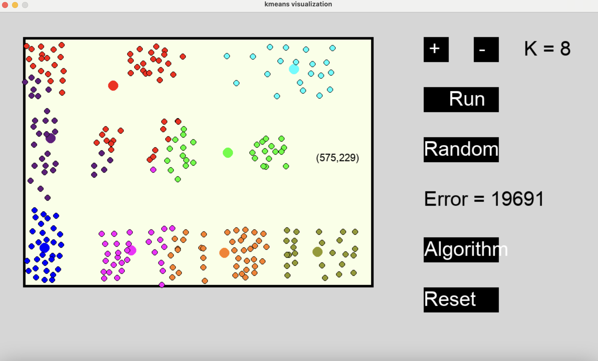
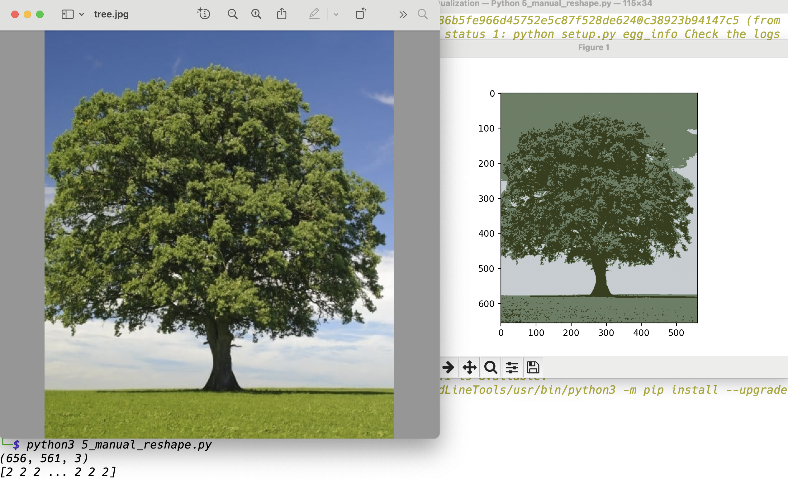
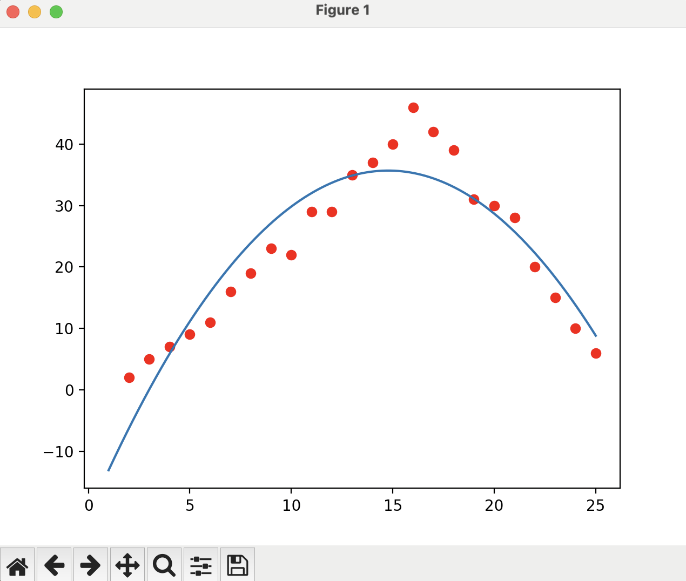
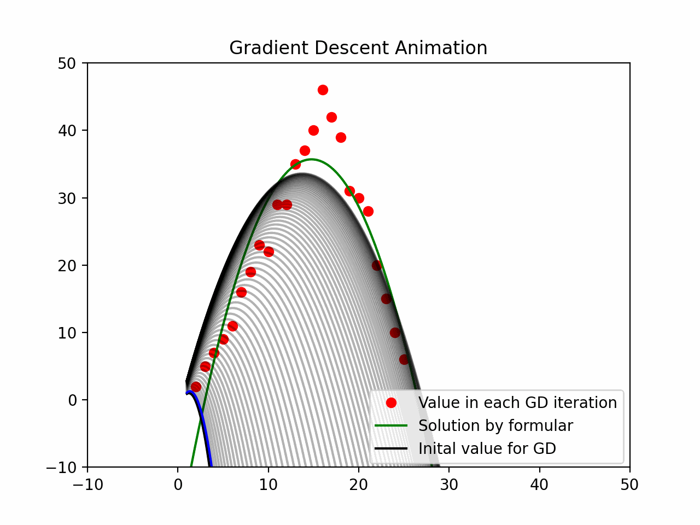

# Machine Learning Visualization Project

This repository contains visualizations for different machine learning algorithms. The images demonstrate clustering, image impression, linear regression, and gradient descent applied to parabolic shapes.

## Visualizations

### 1. K-Means Clustering (Random Clusters)
This visualization demonstrates how the K-Means algorithm groups randomly scattered data points into distinct clusters.



### 2. K-Means for Image Compression 
This project demonstrates image compression using the K-Means clustering algorithm. K-Means is an unsupervised machine learning algorithm that groups similar pixels together, reducing the number of unique colors in an image. This technique is useful for reducing image size while maintaining visual quality.



### 3. Linear Regression for Parabola
This visualization uses linear regression to model a parabolic function.



### 4. Gradient Descent for Parabola
This visualization illustrates how the gradient descent algorithm optimizes a parabolic function.



## How to Use
Clone the repository and explore the `assets/` folder for the images:

```sh
git clone https://github.com/Thang1212/ML-Visualization.git
cd ML-Visualization
```
